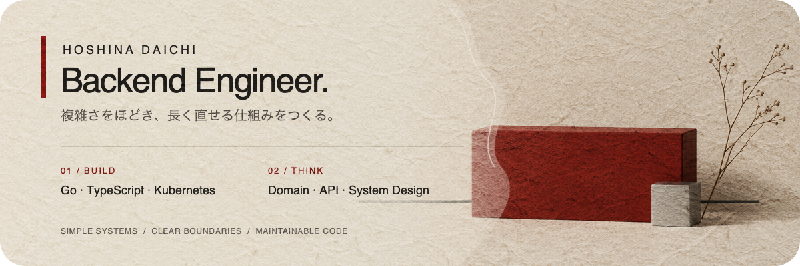

  

## Claude Code のツールを作っています

Claude Code のスキル、plugin、設定、hook を作って公開しています。日々の開発で使う中で足りないものを、1 つずつ形にしています

| repo | 内容 |
|---|---|
| [claude-code-config](https://github.com/DaichiHoshina/claude-code-config) | Claude Code の設定一式 (commands / skills / agents / hooks) |
| [spec-ramo](https://github.com/DaichiHoshina/spec-ramo) | 仕様を PR 単位の Phase に分けて進める spec 駆動開発の plugin |
| [jp-lint](https://github.com/DaichiHoshina/jp-lint) | 日本語の文書を NG 語辞書と文の組み立ての検査で点検して書き換えるスキル |
| [skill-template](https://github.com/DaichiHoshina/skill-template) | 単独の公開スキルを作るための雛形と、公開前の検査 script |

## その他のプロジェクト

  

  
  &nbsp;
  

